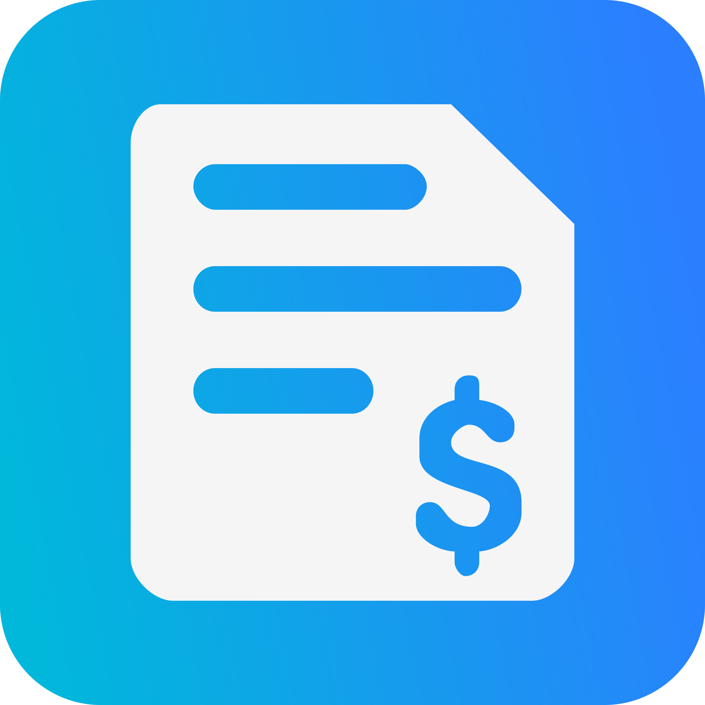

<h1 align="center">QuickBill</h1>

<p align="center">
	Your invoices, your team, your clients...
	<br/>
	
	<br/>
	all connected in one app.
</p>

QuickBill is a cross-platform application designed to simplify billing and invoicing for businesses. It provides an intuitive interface for managing invoices, tracking payments, and generating reports.

## Features

- Create and manage invoices.
- Track payment statuses.
- Generate detailed financial reports.
- Cross-platform support for iOS, Android and Web.

## Implementation Details

### iOS

The iOS implementation is built using Swift and SwiftUI. It leverages the following:

- **CoreData**: For local data storage.
- **Combine**: For reactive programming and state management.
- **UIKit Integration**: For custom UI components where necessary.

### Android

The Android implementation is built using Kotlin and Jetpack Compose. It includes:

- **Room Database**: For local data storage.
- **LiveData and ViewModel**: For reactive programming and state management.
- **Material Design**: For a consistent and modern UI.

## Setup Instructions

1. Clone the repository:

   ```bash
   git clone https://github.com/your-repo/QuickBill-App.git
   ```

2. Navigate to the project directory:

   ```bash
   cd QuickBill-App
   ```

3. Follow platform-specific setup instructions:
   - **iOS**: Open the Xcode project and build the app.
   - **Android**: Open the project in Android Studio and build the app.
   - **Web**: Open the project in your preferred web development environment and run the app.

---

<p align="center">
	Made with ❤️ by <a href="https://github.com/juancarlosacostaperaba">Juan Carlos</a>
</p>
